# Tera Term オリジナル ダイアログ・メニュー 設定項目一覧

## メニュー構成

### File メニュー
| メニュー項目 | キー | 説明 |
|---|---|---|
| New connection... | Ctrl+N | 新規接続ダイアログ (IDD_HOSTDLG) |
| Duplicate session | | セッション複製 |
| Cygwin connection | | Cygwin接続 |
| Log... | | ログダイアログ (IDD_LOGDLG) |
| Comment to Log... | | ログコメント (IDD_COMMENT_DIALOG) |
| View Log | | ログ閲覧 |
| Show Log dialog | | ログダイアログ表示 |
| Send file... | | ファイル送信 (IDD_SENDFILEDLG) |
| Transfer > XMODEM Send | | XMODEM送信 |
| Transfer > XMODEM Receive | | XMODEM受信 |
| Transfer > ZMODEM Send | | ZMODEM送信 |
| Transfer > ZMODEM Receive | | ZMODEM受信 |
| Transfer > Kermit Send | | Kermit送信 |
| Transfer > Kermit Receive | | Kermit受信 |
| Transfer > Kermit Get | | Kermit取得 (IDD_GETFNDLG) |
| Change directory... | | ディレクトリ変更 (IDD_DIRDLG) |
| Replay Log... | | ログ再生 |
| Print... | Ctrl+P | 印刷 |
| Disconnect | | 切断 |
| Close | Ctrl+W | ウィンドウを閉じる |
| Quit | Alt+F4 | 終了 |

### Edit メニュー
| メニュー項目 | キー | 説明 |
|---|---|---|
| Copy | Ctrl+C | コピー |
| Copy table | | テーブル形式コピー |
| Paste | Ctrl+V | 貼り付け (IDD_CLIPBOARD_DIALOG) |
| PasteCR | | CR付き貼り付け |
| Clear screen | | 画面クリア |
| Clear buffer | | バッファクリア |
| Cancel selection | | 選択解除 |
| Select all | Ctrl+A | 全選択 |
| Select screen | | 画面選択 |

### Setup メニュー
| メニュー項目 | キー | 説明 |
|---|---|---|
| Terminal... | | 端末設定 (IDD_TERMDLG) |
| Window... | | ウィンドウ設定 (IDD_WINDLG) |
| Font... | | フォント選択 (システムフォントパネル) |
| Keyboard... | | キーボード設定 (IDD_KEYBDLG) |
| Serial port... | | シリアルポート設定 (IDD_SERIALDLG) |
| TCP/IP... | | TCP/IP設定 (IDD_TCPIPDLG) |
| General... | | 一般設定 (IDD_GENDLG) |
| Additional settings... | | 追加設定 (プロパティシート) |
| Save setup... | | 設定保存 |
| Restore setup... | | 設定復元 |
| Setup directory... | | セットアップディレクトリ |

### Control メニュー
| メニュー項目 | キー | 説明 |
|---|---|---|
| Reset terminal | | 端末リセット |
| Reset port | | ポートリセット |
| Are you there | | AYTコマンド送信 |
| Send break | | ブレーク信号送信 |
| Macro... | Ctrl+Shift+M | マクロ実行 |
| Show Macro Window | | マクロウィンドウ表示 (IDD_CTRLWIN) |
| Broadcast command | | ブロードキャスト (IDD_BROADCAST_DIALOG) |
| Open TEK | | TEKウィンドウ |
| Close TEK | | TEKウィンドウ閉じる |

### Window メニュー
| メニュー項目 | キー | 説明 |
|---|---|---|
| Window list | | ウィンドウ一覧 (IDD_WINLISTDLG) |
| Minimize | | 最小化 |
| Maximize/Restore | | 最大化/復元 |
| Window[n] | | 各ウィンドウ切替 |

### Help メニュー
| メニュー項目 | キー | 説明 |
|---|---|---|
| Index | | ヘルプ索引 |
| About Tera Term... | | バージョン情報 (IDD_ABOUTDLG) |

---

## ダイアログ設定項目一覧

### 1. IDD_HOSTDLG — New connection (新規接続)

| 設定項目 | コントロール | ID | 説明 |
|---|---|---|---|
| TCP/IP | ラジオボタン | IDC_HOSTTCPIP | TCP/IP接続選択 |
| Serial | ラジオボタン | IDC_HOSTSERIAL | シリアル接続選択 |
| Host | コンボボックス | IDC_HOSTNAME | ホスト名 (履歴付き) |
| TCP port# | エディット | IDC_HOSTTCPPORT | TCPポート番号 |
| IP version | コンボボックス | IDC_HOSTTCPPROTOCOL | AUTO/IPv4/IPv6 |
| Telnet | チェックボックス | IDC_HOSTTELNET | Telnetプロトコル使用 |
| Port | コンボボックス | IDC_HOSTCOM | シリアルポート選択 |

### 2. IDD_TERMDLG — Terminal setup (端末設定)

| 設定項目 | コントロール | ID | 説明 |
|---|---|---|---|
| Terminal width | エディット | IDC_TERMWIDTH | 端末幅 (桁数) |
| Terminal height | エディット | IDC_TERMHEIGHT | 端末高さ (行数) |
| Term size = win size | チェックボックス | IDC_TERMISWIN | 端末サイズ=ウィンドウサイズ |
| Auto window resize | チェックボックス | IDC_TERMRESIZE | ウィンドウ自動リサイズ |
| Receive newline | コンボボックス | IDC_TERMCRRCV | 受信改行コード (CR/CR+LF/LF/AUTO) |
| Transmit newline | コンボボックス | IDC_TERMCRSEND | 送信改行コード (CR/CR+LF/LF) |
| Terminal ID | コンボボックス | IDC_TERMID | VT100/VT101/VT102/VT220/VT282/VT320/VT382/VT420/VT520/VT525 |
| Local echo | チェックボックス | IDC_TERMLOCALECHO | ローカルエコー |
| Answerback | エディット | IDC_TERMANSBACK | アンサーバック文字列 |
| Auto switch VT↔TEK | チェックボックス | IDC_TERMAUTOSWITCH | VT/TEK自動切替 |

### 3. IDD_WINDLG — Window setup (ウィンドウ設定)

| 設定項目 | コントロール | ID | 説明 |
|---|---|---|---|
| Title | エディット | IDC_WINTITLE | ウィンドウタイトル |
| Block cursor | ラジオボタン | IDC_WINBLOCK | ブロックカーソル |
| Vertical line cursor | ラジオボタン | IDC_WINVERT | 縦線カーソル |
| Horizontal line cursor | ラジオボタン | IDC_WINHORZ | 横線カーソル |
| Enable bold font | チェックボックス | IDC_FONTBOLD | 太字フォント有効 |
| Hide title bar | チェックボックス | IDC_WINHIDETITLE | タイトルバー非表示 |
| No Frame | チェックボックス | IDC_NO_FRAME | フレームなし |
| Hide menu bar | チェックボックス | IDC_WINHIDEMENU | メニューバー非表示 |
| 16 Colors (PC style) | チェックボックス | IDC_WINCOLOREMU | PCスタイル16色 |
| 16 Colors (aixterm) | チェックボックス | IDC_WINAIXTERM16 | aixterm16色 |
| 256 Colors (xterm) | チェックボックス | IDC_WINXTERM256 | xterm256色 |
| Scroll buffer | チェックボックス | IDC_WINSCROLL1 | スクロールバッファ有効 |
| Scroll buffer lines | エディット | IDC_WINSCROLL2 | スクロールバッファ行数 |
| Text color | ラジオボタン | IDC_WINTEXT | テキスト色選択 |
| Background color | ラジオボタン | IDC_WINBACK | 背景色選択 |
| Attribute | コンボボックス | IDC_WINATTR | 属性選択 |
| Swap colors | ボタン | IDC_WIN_SWAP_COLORS | 前景/背景色入替 |
| Red | スクロールバー | IDC_WINREDBAR | 赤 (0-255) |
| Green | スクロールバー | IDC_WINGREENBAR | 緑 (0-255) |
| Blue | スクロールバー | IDC_WINBLUEBAR | 青 (0-255) |
| Use Normal BG | チェックボックス | IDC_WINUSENORMALBG | 通常背景色使用 |

### 4. IDD_KEYBDLG — Keyboard setup (キーボード設定)

| 設定項目 | コントロール | ID | 説明 |
|---|---|---|---|
| Backspace key | チェックボックス | IDC_KEYBBS | BSキーでDEL送信 |
| Delete key | チェックボックス | IDC_KEYBDEL | DELキーでDEL送信 |
| Keyboard | コンボボックス | IDC_KEYBKEYB | キーボード種別 |
| Meta key | コンボボックス | IDC_KEYBMETA | Metaキー (off/on) |
| Application Keypad | チェックボックス | IDC_KEYBAPPKEY | アプリケーションキーパッド無効 |
| Application Cursor | チェックボックス | IDC_KEYBAPPCUR | アプリケーションカーソル無効 |

### 5. IDD_SERIALDLG — Serial port setup (シリアルポート設定)

| 設定項目 | コントロール | ID | 説明 |
|---|---|---|---|
| Port | コンボボックス | IDC_SERIALPORT | ポートデバイス |
| Speed | コンボボックス | IDC_SERIALBAUD | ボーレート (110-921600) |
| Data | コンボボックス | IDC_SERIALDATA | データビット (7/8) |
| Parity | コンボボックス | IDC_SERIALPARITY | パリティ (None/Odd/Even/Mark/Space) |
| Stop bits | コンボボックス | IDC_SERIALSTOP | ストップビット (1/1.5/2) |
| Flow control | コンボボックス | IDC_SERIALFLOW | フロー制御 (None/Xon/Xoff/Hardware) |
| CTS | チェックボックス | IDC_CHECK_CTS | CTS信号状態 |
| RTS | チェックボックス | IDC_CHECK_RTS | RTS制御 |
| RTS mode | コンボボックス | IDC_SERIALRTS | RTS制御モード |
| DSR | チェックボックス | IDC_CHECK_DSR | DSR信号状態 |
| DTR | チェックボックス | IDC_CHECK_DTR | DTR制御 |
| DTR mode | コンボボックス | IDC_SERIALDTR | DTR制御モード |
| RING | チェックボックス | IDC_CHECK_RING | RING信号状態 |
| RLSD | チェックボックス | IDC_CHECK_RLSD | RLSD信号状態 |
| msec/char | エディット | IDC_SERIALDELAYCHAR | 文字間送信遅延 (ms) |
| msec/line | エディット | IDC_SERIALDELAYLINE | 行間送信遅延 (ms) |

### 6. IDD_TCPIPDLG — TCP/IP setup

| 設定項目 | コントロール | ID | 説明 |
|---|---|---|---|
| Save history | チェックボックス | IDC_TCPIPHISTORY | 接続時に履歴保存 |
| Edit host list | ボタン | IDC_TCPIP_EDITHISTORY | ホスト一覧編集 |
| Telnet | チェックボックス | IDC_TCPIP_TELNET | Telnetプロトコル |
| TCP Port# | エディット | IDC_TCPIPPORT | TCPポート番号 |
| Telnet Keep alive | エディット | IDC_TCPIPTELNETKEEPALIVE | Telnet Keepalive秒数 |
| Auto window close | チェックボックス | IDC_TCPIPAUTOCLOSE | ウィンドウ自動クローズ |
| Term type | エディット | IDC_TCPIPTERMTYPE | 端末タイプ文字列 |

### 7. IDD_GENDLG — General setup (一般設定)

| 設定項目 | コントロール | ID | 説明 |
|---|---|---|---|
| Language/UI | コンボボックス | IDC_GENLANG_UI | UI言語選択 |

### 8. IDD_ABOUTDLG — About (バージョン情報)

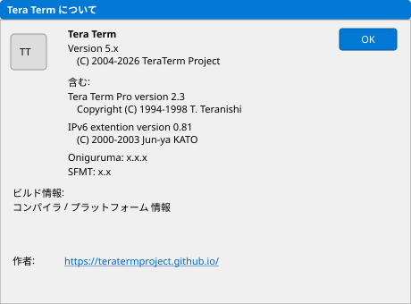

| 表示項目 | ID | 説明 |
|---|---|---|
| Icon | IDC_TT_ICON | アプリアイコン |
| Title | IDC_TT_PRO | "Tera Term" |
| Version | IDC_TT_VERSION | バージョン番号 |
| Project | IDC_PROJECT_LABEL | プロジェクト著作権 |
| TT Pro 2.3 | IDC_TT23_LABEL | 原作者情報 |
| IPv6 | IDC_IPV6_LABEL | IPv6拡張情報 |
| Oniguruma | IDC_ONIGURUMA_LABEL | 正規表現ライブラリ |
| SFMT | IDC_SFMT_VERSION | 乱数ライブラリ |
| Build info | IDC_BUILDTOOL | ビルド情報 |
| Author URL | IDC_AUTHOR_URL | プロジェクトURL |

---

## 追加設定 (Additional Settings) プロパティシートタブ

### 9. IDD_TABSHEET_GENERAL — General タブ

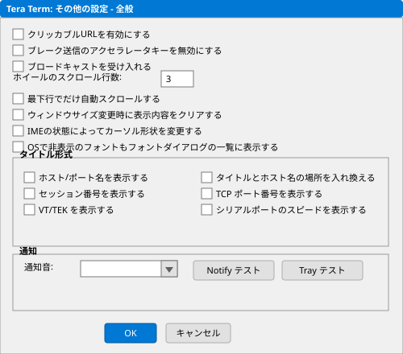

| 設定項目 | コントロール | ID | 説明 |
|---|---|---|---|
| Disable SendBreak | チェックボックス | IDC_DISABLE_SENDBREAK | ブレーク送信無効 |
| Accept broadcast | チェックボックス | IDC_ACCEPT_BROADCAST | ブロードキャスト受信 |
| Auto scroll only in bottom | チェックボックス | IDC_AUTOSCROLL_ONLY_IN_BOTTOM_LINE | 最下行でのみ自動スクロール |
| Clear on resize | チェックボックス | IDC_CLEAR_ON_RESIZE | リサイズ時画面クリア |
| Cursor change IME | チェックボックス | IDC_CURSOR_CHANGE_IME | IMEでカーソル変更 |
| Default port | コンボボックス | IDC_GENPORT | デフォルトポート |
| Title format checkboxes | 複数チェックボックス | IDC_TITLE_* | タイトル表示形式 |
| Notification title | チェックボックス | IDC_NOTIFICATION_TITLE | 通知タイトル |
| Notify sound | チェックボックス | IDC_NOTIFY_SOUND | 通知音 |
| Test popup | ボタン | IDC_NOTIFICATION_TEST_POPUP | ポップアップテスト |
| Test tray | ボタン | IDC_NOTIFICATION_TEST_TRAY | トレイテスト |
| File transfer folder | エディット | IDC_FILE_DIR | 転送フォルダ |

### 10. IDD_TABSHEET_SEQUENCE — Sequence タブ

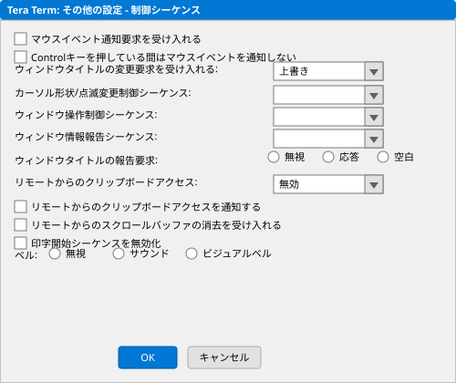

| 設定項目 | コントロール | ID | 説明 |
|---|---|---|---|
| Accept mouse event tracking | チェックボックス | IDC_ACCEPT_MOUSE_EVENT_TRACKING | マウスイベント追跡 |
| Disable mouse tracking ctrl | チェックボックス | IDC_DISABLE_MOUSE_TRACKING_CTRL | Ctrlでマウス追跡無効 |
| Accept title changing | コンボボックス | IDC_ACCEPT_TITLE_CHANGING | タイトル変更制御シーケンス |
| Title report | コンボボックス | IDC_TITLE_REPORT | タイトルレポート |
| Window control | チェックボックス | IDC_WINDOW_CTRL | ウィンドウ制御シーケンス |
| Window report | チェックボックス | IDC_WINDOW_REPORT | ウィンドウレポート |
| Cursor control sequence | チェックボックス | IDC_CURSOR_CTRL_SEQ | カーソル制御シーケンス |
| Clipboard access | コンボボックス | IDC_CLIPBOARD_ACCESS | クリップボードアクセス |
| Clipboard notify | チェックボックス | IDC_CLIPBOARD_NOTIFY | クリップボード通知 |
| Accept clear scroll buffer | チェックボックス | IDC_ACCEPT_CLEAR_SBUFF | スクロールバッファクリア許可 |
| Disable print start | チェックボックス | IDC_DISABLE_PRINT_START | 印刷開始無効 |
| Beep | コンボボックス | IDC_BEEP_DROPDOWN | ビープ音 (None/System/Visual) |

### 11. IDD_TABSHEET_COPYPASTE — Copy and Paste タブ

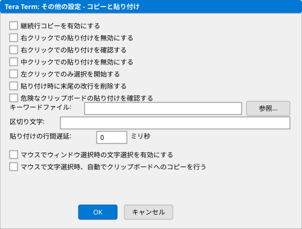

| 設定項目 | コントロール | ID | 説明 |
|---|---|---|---|
| Enable continued line copy | チェックボックス | IDC_LINECOPY | 連続行コピー有効 |
| Disable paste right button | チェックボックス | IDC_DISABLE_PASTE_RBUTTON | 右クリック貼付無効 |
| Confirm paste right button | チェックボックス | IDC_CONFIRM_PASTE_RBUTTON | 右クリック貼付確認 |
| Disable paste middle button | チェックボックス | IDC_DISABLE_PASTE_MBUTTON | 中クリック貼付無効 |
| Select left button | チェックボックス | IDC_SELECT_LBUTTON | 左クリック選択 |
| Trim trailing newline | チェックボックス | IDC_TRIMNLCHAR | 末尾改行トリム |
| Confirm change paste | チェックボックス | IDC_CONFIRM_CHANGE_PASTE | 貼付変更確認 |
| Confirm string file | エディット | IDC_CONFIRM_STRING_FILE | 確認文字列ファイル |
| Delimiter list | エディット | IDC_DELIM_LIST | 区切り文字一覧 |
| Paste delay per line | エディット | IDC_PASTEDELAY_EDIT | 行毎貼付遅延 (msec) |
| Select on activate | チェックボックス | IDC_SELECT_ON_ACTIVATE | アクティブ時選択 |
| Auto text copy | チェックボックス | IDC_AUTO_TEXT_COPY | 自動テキストコピー |

### 12. IDD_TABSHEET_VISUAL — Visual タブ

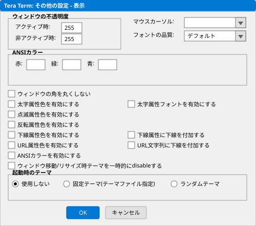

| 設定項目 | コントロール | ID | 説明 |
|---|---|---|---|
| Active opacity | エディット+スライダー | IDC_ALPHA_BLEND_ACTIVE | アクティブ時透明度 |
| Inactive opacity | エディット+スライダー | IDC_ALPHA_BLEND_INACTIVE | 非アクティブ時透明度 |
| Mouse cursor | コンボボックス | IDC_MOUSE_CURSOR | マウスカーソル形状 |
| ANSI Color list | リストボックス | IDC_ANSI_COLOR | ANSI16色パレット |
| Color R/G/B | エディット | IDC_COLOR_RED/GREEN/BLUE | 色RGB値 |
| Sample color | 表示領域 | IDC_SAMPLE_COLOR | 色プレビュー |
| Font quality | コンボボックス | IDC_FONT_QUALITY | フォント描画品質 |
| Flicker-less move | チェックボックス | IDC_CHECK_FLICKER_LESS_MOVE | ちらつき抑制移動 |
| Corner don't round | チェックボックス | IDC_CHECK_CORNERDONTROUND | 角丸め無効 |
| Bold color | チェックボックス | IDC_ENABLE_ATTR_COLOR_BOLD | 太字色有効 |
| Blink color | チェックボックス | IDC_ENABLE_ATTR_COLOR_BLINK | 点滅色有効 |
| Reverse color | チェックボックス | IDC_ENABLE_ATTR_COLOR_REVERSE | 反転色有効 |
| URL color | チェックボックス | IDC_ENABLE_ATTR_COLOR_URL | URL色有効 |
| Underline color | チェックボックス | IDC_ENABLE_ATTR_COLOR_UNDERLINE | 下線色有効 |
| ANSI color | チェックボックス | IDC_ENABLE_ANSI_COLOR | ANSI色有効 |

### 13. IDD_TABSHEET_LOG — Log タブ

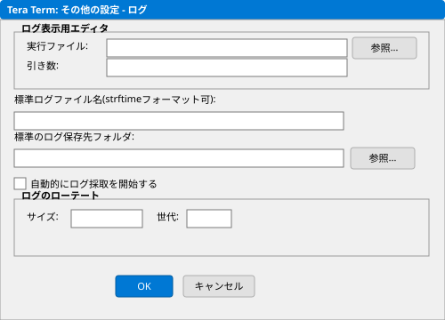

| 設定項目 | コントロール | ID | 説明 |
|---|---|---|---|
| View log editor | エディット | IDC_VIEWLOG_EDITOR_EXE | ログビューアパス |
| Editor arguments | エディット | IDC_VIEWLOG_EDITOR_ARG | エディタ引数 |
| Default name | コンボボックス | IDC_DEFAULTNAME_EDITOR | デフォルトログ名 |
| Default path | エディット | IDC_DEFAULTPATH_EDITOR | デフォルトログパス |
| Auto start | チェックボックス | IDC_AUTOSTART | 自動開始 |
| Binary | チェックボックス | IDC_OPT_BINARY | バイナリモード |
| Append | チェックボックス | IDC_OPT_APPEND | 追記モード |
| Plain text | チェックボックス | IDC_OPT_PLAINTEXT | プレーンテキスト |
| Hide dialog | チェックボックス | IDC_OPT_HIDEDLG | ダイアログ非表示 |
| Include buffer | チェックボックス | IDC_OPT_INCBUF | バッファ含む |
| Timestamp | チェックボックス | IDC_OPT_TIMESTAMP | タイムスタンプ |
| Timestamp type | コンボボックス | IDC_OPT_TIMESTAMP_TYPE | タイムスタンプ形式 |
| Log rotate | チェックボックス | IDC_LOG_ROTATE | ログローテーション |
| Rotate size | エディット+コンボ | IDC_ROTATE_SIZE | ローテーションサイズ |
| Rotate step | エディット | IDC_ROTATE_STEP | ローテーションステップ |

### 14. IDD_TABSHEET_CODING — Coding タブ

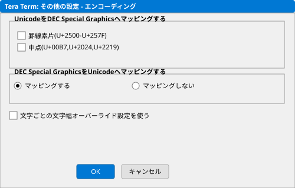

| 設定項目 | コントロール | ID | 説明 |
|---|---|---|---|
| Receive encoding | コンボボックス | IDC_TERMKANJI | 受信エンコーディング |
| Send encoding | コンボボックス | IDC_TERMKANJISEND | 送信エンコーディング |
| Use different code | チェックボックス | IDC_USE_DIFFERENT_CODE | 送受信別エンコーディング |
| Ambiguous width | コンボボックス | IDC_AMBIGUOUS_WIDTH_COMBO | 曖昧幅文字 (1/2セル) |
| Emoji width | チェックボックス+コンボ | IDC_EMOJI_WIDTH_CHECK | 絵文字幅 |
| Override char width | チェックボックス+コンボ | IDC_OVERRIDE_CHAR_WIDTH | 文字幅上書き |
| Unicode to DEC | ラジオボタン | IDC_DECSP_UNI2DEC | Unicode→DEC変換 |
| DEC to Unicode | ラジオボタン | IDC_DECSP_DEC2UNI | DEC→Unicode変換 |
| Do not convert | ラジオボタン | IDC_DECSP_DO_NOT | 変換なし |
| Box drawing | チェックボックス | IDC_DEC2UNICODE_BOXDRAWING | 罫線文字変換 |
| Punctuation | チェックボックス | IDC_DEC2UNICODE_PUNCTUATION | 句読点変換 |
| Middle dot | チェックボックス | IDC_DEC2UNICODE_MIDDLEDOT | 中点変換 |
| Kana receive | チェックボックス | IDC_TERMKANA | カナ受信 |
| Kana send | チェックボックス | IDC_TERMKANASEND | カナ送信 |
| Kanji-in | コンボボックス | IDC_TERMKIN | 漢字IN |
| Kanji-out | コンボボックス | IDC_TERMKOUT | 漢字OUT |

### 15. IDD_TABSHEET_FONT — Font タブ

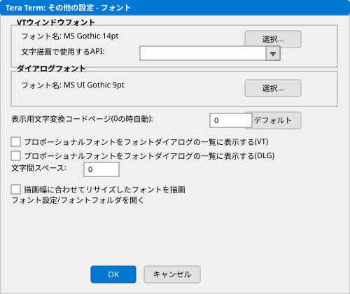

| 設定項目 | コントロール | ID | 説明 |
|---|---|---|---|
| Current font | 表示+ボタン | IDC_VTFONT_EDIT | 現在のフォント |
| Select font | ボタン | IDC_VTFONT_CHOOSE | フォント選択 |
| List proportional fonts | チェックボックス | IDC_LIST_PRO_FONTS_VT | プロポーショナルフォント表示 |
| List hidden fonts | チェックボックス | IDC_LIST_HIDDEN_FONTS | 非表示フォント表示 |
| Resized font | チェックボックス | IDC_RESIZED_FONT | リサイズフォント |
| Drawing API | コンボボックス | IDC_VTFONT_COMBO | 描画API |
| Code page | エディット | IDC_VTFONT_CODEPAGE_EDIT | コードページ |
| Space top/bottom/left/right | エディット | IDC_SPACE_* | 文字間隔 |

### 16. IDD_TABSHEET_CYGWIN — Cygwin タブ

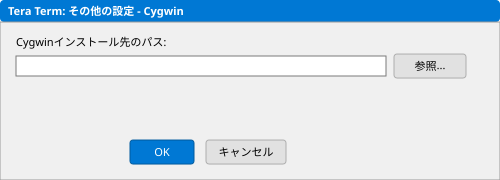

| 設定項目 | コントロール | ID | 説明 |
|---|---|---|---|
| Cygwin path | エディット | IDC_CYGWIN_PATH | Cygwinパス |
| Term | エディット | IDC_TERM_EDIT | ターミナル |
| Term type | エディット | IDC_TERM_TYPE | 端末タイプ |
| Port start | エディット | IDC_PORT_START | 開始ポート |
| Port range | エディット | IDC_PORT_RANGE | ポート範囲 |
| Shell | エディット | IDC_SHELL | シェル |
| Env1/Env2 | エディット | IDC_ENV1/ENV2 | 環境変数 |
| Login shell | チェックボックス | IDC_LOGIN_SHELL | ログインシェル |
| Home chdir | チェックボックス | IDC_HOME_CHDIR | ホームディレクトリ移動 |
| Agent proxy | チェックボックス | IDC_AGENT_PROXY | エージェントプロキシ |

### 17. IDD_TABSHEET_MOUSE — Mouse タブ

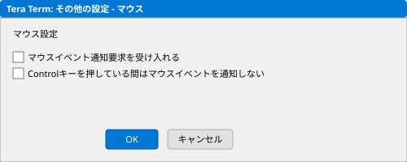

| 設定項目 | コントロール | ID | 説明 |
|---|---|---|---|
| Enable clickable URL | チェックボックス | IDC_CLICKABLE_URL | クリッカブルURL |
| Scroll lines | エディット | IDC_SCROLL_LINE | ホイールスクロール行数 |

### 18. IDD_TABSHEET_UI — UI タブ

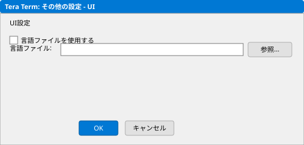

| 設定項目 | コントロール | ID | 説明 |
|---|---|---|---|
| UI Language | コンボボックス | IDC_GENUILANG | UI言語 |
| Dialog font | エディット+ボタン | IDC_DLGFONT_EDIT | ダイアログフォント |
| Select font | ボタン | IDC_DLGFONT_CHOOSE | フォント選択 |
| Default | ボタン | IDC_DLGFONT_DEFAULT | デフォルトに戻す |

### 19. IDD_TABSHEET_DEBUG — Debug タブ

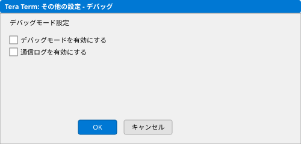

| 設定項目 | コントロール | ID | 説明 |
|---|---|---|---|
| Enable popup | チェックボックス | IDC_DEBUG_POPUP_ENABLE | 文字情報ポップアップ |
| Key 1/2 | コンボボックス | IDC_DEBUG_POPUP_KEY1/KEY2 | キー割当 |
| Display console | ボタン | IDC_DEBUG_CONSOLE_BUTTON | コンソール表示 |
| Dump | ボタン | IDC_BUTTON_DUMP | ダンプ |

### 20. IDD_TABSHEET_PLUGIN — Plugin タブ

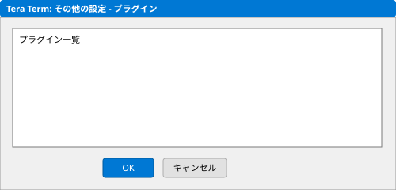

| 設定項目 | コントロール | ID | 説明 |
|---|---|---|---|
| Setup directories | リストビュー | IDC_SETUP_DIR_LIST | プラグインディレクトリ一覧 |
| ADD | ボタン | IDC_BUTTON_ADD | ディレクトリ追加 |

### 21. IDD_TABSHEET_THEME — Theme タブ

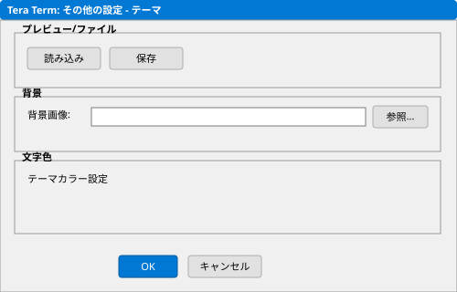

| 設定項目 | コントロール | ID | 説明 |
|---|---|---|---|
| Enable | チェックボックス | IDC_THEME_ENABLE | テーマ有効 |
| Theme Editor | ボタン | IDC_THEME_EDITOR_BUTTON | テーマエディタ起動 |
| Fast size move | チェックボックス | IDC_CHECK_FAST_SIZE_MOVE | 高速サイズ変更 |
| Startup theme | コンボボックス | IDC_THEME_FILE | 起動時テーマ |
| Theme file | エディット | IDC_THEME_EDIT | テーマファイルパス |
| Susie Plug-in path | エディット | IDC_SPIPATH_EDIT | Susieプラグインパス |

### 22. IDD_TABSHEET_TEKFONT — TEK Font タブ

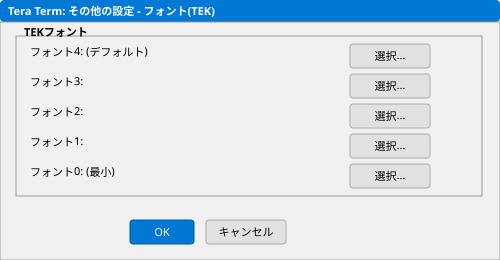

| 設定項目 | コントロール | ID | 説明 |
|---|---|---|---|
| TEK Font | エディット+ボタン | IDC_DLGFONT_EDIT | TEKフォント選択 |

---

## ファイル転送ダイアログ

### 23. IDD_SENDFILEDLG — Send file (ファイル送信)

| 設定項目 | コントロール | ID | 説明 |
|---|---|---|---|
| Filename | コンボボックス | IDC_SENDFILE_FILENAME_EDIT | ファイル名 |
| Bulk read | ラジオボタン | IDC_SENDFILE_RADIO_BULK | 一括読込 |
| Sequential read | ラジオボタン | IDC_SENDFILE_RADIO_SEQUENTIAL | 逐次読込 |
| Binary | チェックボックス | IDC_SENDFILE_CHECK_BINARY | バイナリモード |
| Delay type | コンボボックス | IDC_SENDFILE_DELAYTYPE_DROPDOWN | 遅延タイプ |
| Send size | コンボボックス | IDC_SENDFILE_SEND_SIZE_DROPDOWN | 送信サイズ |
| Delay time (msec) | エディット | IDC_SENDFILE_DELAYTIME_EDIT | 遅延時間 |

### 24. IDD_RECVFILEDLG — Receive file (ファイル受信)

| 設定項目 | コントロール | ID | 説明 |
|---|---|---|---|
| Filename | コンボボックス | IDC_RECVFILE_FILENAME_EDIT | ファイル名 |
| Binary | チェックボックス | IDC_RECVFILE_CHECK_BINARY | バイナリモード |
| Auto-stop wait (sec) | エディット | IDC_RECVFILE_AUTOSTOP_EDIT | 自動停止待機秒数 |

### 25. IDD_FILETRANSDLG — File Transfer Progress (転送進捗)

| 表示項目 | コントロール | ID | 説明 |
|---|---|---|---|
| Filename | 表示 | IDC_TRANSFNAME | ファイル名 |
| Full path | 表示 | IDC_EDIT_FULLPATH | フルパス |
| Bytes | 表示 | IDC_TRANSBYTES | 転送バイト数 |
| Elapsed time | 表示 | IDC_TRANS_ETIME | 経過時間 |
| Progress | プログレスバー | IDC_TRANSPROGRESS | 進捗 |

### 26. IDD_PROTDLG — Protocol Transfer (プロトコル転送)

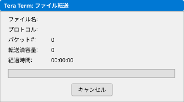

| 表示項目 | コントロール | ID | 説明 |
|---|---|---|---|
| Filename | 表示 | IDC_PROTOFNAME | ファイル名 |
| Protocol | 表示 | IDC_PROTOPROT | プロトコル名 |
| Packet# | 表示 | IDC_PROTOPKTNUM | パケット番号 |
| Bytes | 表示 | IDC_PROTOBYTECOUNT | バイト数 |
| Elapsed time | 表示 | IDC_PROTOELAPSEDTIME | 経過時間 |
| Percent | 表示 | IDC_PROTOPERCENT | 進捗率 |

### 27. IDD_DAD_DIALOG — Drag and Drop (ドラッグ&ドロップ)

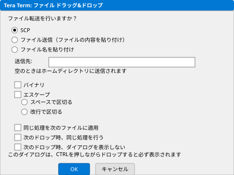

| 設定項目 | コントロール | ID | 説明 |
|---|---|---|---|
| File path | エディット | IDC_FILENAME_EDIT | ファイルパス |
| SCP | ラジオボタン | IDC_SCP_RADIO | SCP転送 |
| SCP destination | エディット | IDC_SCP_PATH | SCP送信先パス |
| Send file | ラジオボタン | IDC_SENDFILE_RADIO | ファイル送信 |
| Paste | ラジオボタン | IDC_PASTE_RADIO | テキスト貼付 |
| Binary | チェックボックス | IDC_BINARY_CHECK | バイナリモード |
| Escape | チェックボックス | IDC_ESCAPE_CHECK | エスケープ |
| Space separator | ラジオボタン | IDC_SPACE_RADIO | スペース区切り |
| Newline separator | ラジオボタン | IDC_NEWLINE_RADIO | 改行区切り |
| Same process | チェックボックス | IDC_SAME_PROCESS_CHECK | 同一プロセス |
| Don't show | チェックボックス | IDC_DONTSHOW_CHECK | 次回表示しない |

---

## その他のダイアログ

### 28. IDD_LOGDLG — Log (ログ設定)

| 設定項目 | コントロール | ID | 説明 |
|---|---|---|---|
| Filename | コンボボックス | IDC_FOPT_FILENAME_EDIT | ログファイル名 |
| New/Overwrite | ラジオボタン | IDC_NEW_OVERWRITE | 新規/上書き |
| Append | ラジオボタン | IDC_APPEND | 追記 |
| Text | ラジオボタン | IDC_FOPTTEXT | テキスト形式 |
| Binary | ラジオボタン | IDC_FOPTBIN | バイナリ形式 |
| BOM | チェックボックス | IDC_BOM | BOM付加 |
| Text coding | コンボボックス | IDC_TEXTCODING_DROPDOWN | テキストエンコーディング |
| Plain text | チェックボックス | IDC_PLAINTEXT | プレーンテキスト |
| Timestamp | チェックボックス | IDC_TIMESTAMP | タイムスタンプ |
| Hide dialog | チェックボックス | IDC_HIDEDIALOG | ダイアログ非表示 |
| Include buffer | チェックボックス | IDC_ALLBUFF_INFIRST | バッファ含む |

### 29. IDD_CLIPBOARD_DIALOG — Clipboard confirmation (クリップボード確認)

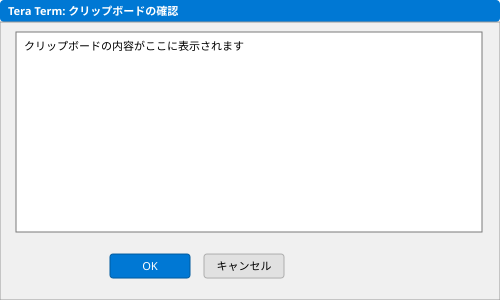

| 表示項目 | コントロール | ID | 説明 |
|---|---|---|---|
| Content | テキストエリア | IDC_EDIT | クリップボード内容プレビュー |

### 30. IDD_BROADCAST_DIALOG — Broadcast command (ブロードキャスト)

| 設定項目 | コントロール | ID | 説明 |
|---|---|---|---|
| Command | コンボボックス | IDC_COMMAND_EDIT | コマンド入力 |
| History | チェックボックス | IDC_HISTORY_CHECK | 履歴有効 |
| CR+LF | ラジオボタン | IDC_RADIO_CRLF | CR+LF改行 |
| CR | ラジオボタン | IDC_RADIO_CR | CR改行 |
| LF | ラジオボタン | IDC_RADIO_LF | LF改行 |
| Enter key | チェックボックス | IDC_ENTERKEY_CHECK | Enterキー送信 |
| This process only | チェックボックス | IDC_PARENT_ONLY | 自プロセスのみ |
| Realtime mode | チェックボックス | IDC_REALTIME_CHECK | リアルタイムモード |
| Window list | リストボックス | IDC_LIST | 対象ウィンドウ一覧 |

### 31. IDD_DIRDLG — Change directory (ディレクトリ変更)

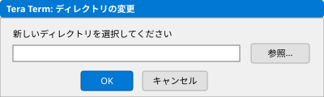

| 設定項目 | コントロール | ID | 説明 |
|---|---|---|---|
| Current dir | 表示 | IDC_DIRCURRENT | 現在のディレクトリ |
| New dir | エディット | IDC_DIRNEW | 新しいディレクトリ |

### 32. IDD_WINLISTDLG — Window list (ウィンドウ一覧)

| 項目 | コントロール | ID | 説明 |
|---|---|---|---|
| Window list | リストボックス | IDC_WINLISTLIST | ウィンドウ一覧 |
| Close window | ボタン | IDC_WINLISTCLOSE | ウィンドウを閉じる |

### 33. IDD_EDITHISTORYDLG — Edit History (履歴編集)

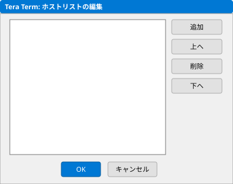

| 設定項目 | コントロール | ID | 説明 |
|---|---|---|---|
| Host | エディット | IDC_TCPIPHOST | ホスト名入力 |
| Add | ボタン | IDC_TCPIPADD | ホスト追加 |
| History list | リストボックス | IDC_TCPIPLIST | 履歴一覧 |
| Up/Down/Remove | ボタン | IDC_TCPIPUP/REMOVE/DOWN | 順序変更/削除 |

### 34. IDD_PRNABORTDLG — Print Abort (印刷中止)

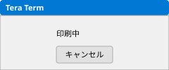

### 35. IDD_GETFNDLG — Kermit Get

| 設定項目 | コントロール | ID | 説明 |
|---|---|---|---|
| Filename | エディット | IDC_GETFN | 取得ファイル名 |

---

## マクロダイアログ (TTPMACRO)

### 36. IDD_CTRLWIN — Macro control (マクロ制御)

| 項目 | コントロール | ID | 説明 |
|---|---|---|---|
| Pause/Start | ボタン | IDC_CTRLPAUSESTART | 一時停止/再開 |
| End | ボタン | IDC_CTRLEND | マクロ終了 |
| Line number | 表示 | IDC_LINENO | 現在行番号 |
| Filename | 表示 | IDC_FILENAME | 実行中ファイル名 |

### 37. IDD_ERRDLG — Macro error (マクロエラー)

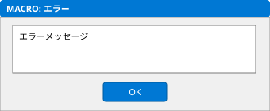

| 項目 | コントロール | ID | 説明 |
|---|---|---|---|
| Error message | 表示 | IDC_ERRMSG | エラーメッセージ |
| Error line | 表示+エディット | IDC_ERRLINE/EDIT_ERRLINE | エラー行 |

### 38. IDD_INPDLG — Input (マクロ入力)

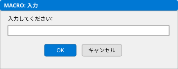

| 項目 | コントロール | ID | 説明 |
|---|---|---|---|
| Prompt | 表示 | IDC_INPTEXT | 入力プロンプト |
| Input | パスワードエディット | IDC_INPEDIT | 入力フィールド |

### 39. IDD_MSGDLG — Message (マクロメッセージ)

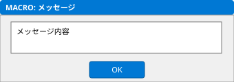

| 項目 | コントロール | ID | 説明 |
|---|---|---|---|
| Message | 表示 | IDC_MSGTEXT | メッセージテキスト |

### 40. IDD_STATDLG — Status (マクロステータス)

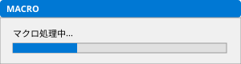

| 項目 | コントロール | ID | 説明 |
|---|---|---|---|
| Status | 表示 | IDC_STATTEXT | ステータステキスト |

### 41. IDD_LISTDLG — List (マクロリスト)

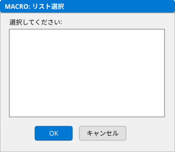

| 項目 | コントロール | ID | 説明 |
|---|---|---|---|
| Description | 表示 | IDC_LISTTEXT | 説明テキスト |
| List | リストボックス | IDC_LISTBOX | 選択肢一覧 |

---

## テーマエディタダイアログ

### 42. Background Theme Editor

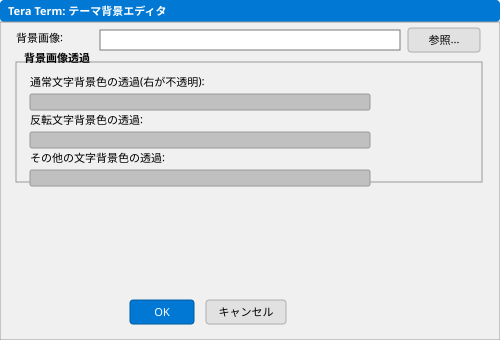

| 設定項目 | コントロール | ID | 説明 |
|---|---|---|---|
| Simple color plane | チェックボックス | IDC_SIMPLE_COLOR_PLANE_CHECK | 単色背景 |
| Color sample | 色表示 | IDC_SIMPLE_COLOR_PLANE_SAMPLE | 色プレビュー |
| Color select | ボタン | IDC_SIMPLE_COLOR_PLANE_BUTTON | 色選択 |
| Alpha | スライダー | IDC_SIMPLE_COLOR_PLANE_ALPHA_SLIDER | 透明度 |
| Background image | チェックボックス | IDC_BGIMG_CHECK | 背景画像有効 |
| Image file | エディット | IDC_BGIMG_EDIT | 画像ファイルパス |
| Pattern | コンボボックス | IDC_BGIMG_COMBO | 表示パターン |
| Desktop wallpaper | チェックボックス | IDC_WALLPAPER_CHECK | デスクトップ壁紙 |

### 43. Color Theme Editor

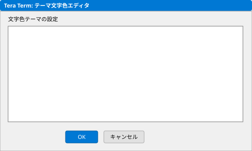

| 設定項目 | コントロール | ID | 説明 |
|---|---|---|---|
| Color list | リストビュー | IDC_COLOR_LIST | ANSI 16色パレット |
| Default | ボタン | IDC_COLOR_DEFAULT_BUTTON | デフォルトに戻す |

---

## 統計情報

| カテゴリ | ダイアログ数 |
|---|---|
| 基本設定 (Setup メニュー) | 7 |
| 追加設定タブ | 14 |
| ファイル転送 | 5 |
| マクロ (TTPMACRO) | 6 |
| テーマエディタ | 2 |
| その他 (接続/ブロードキャスト/履歴等) | 9 |
| **合計** | **43** |
